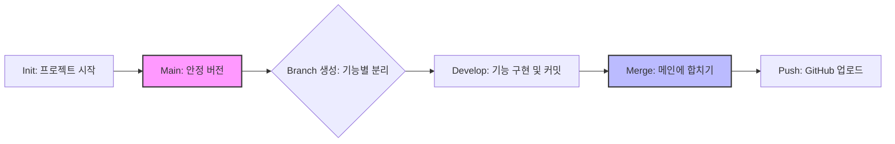
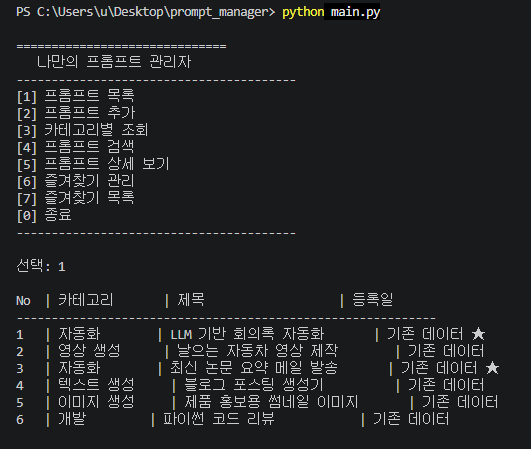
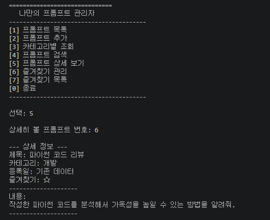
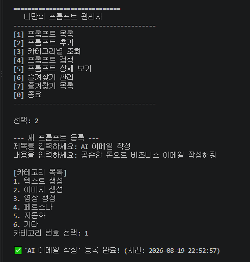
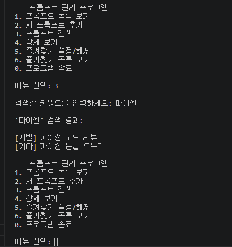
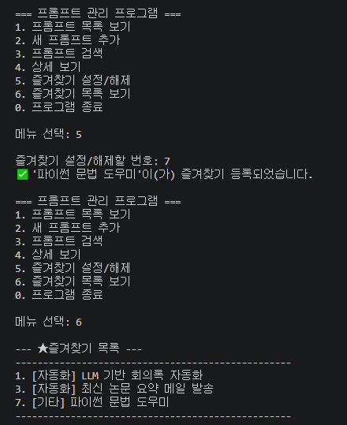
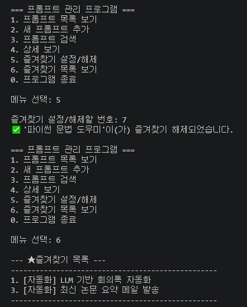
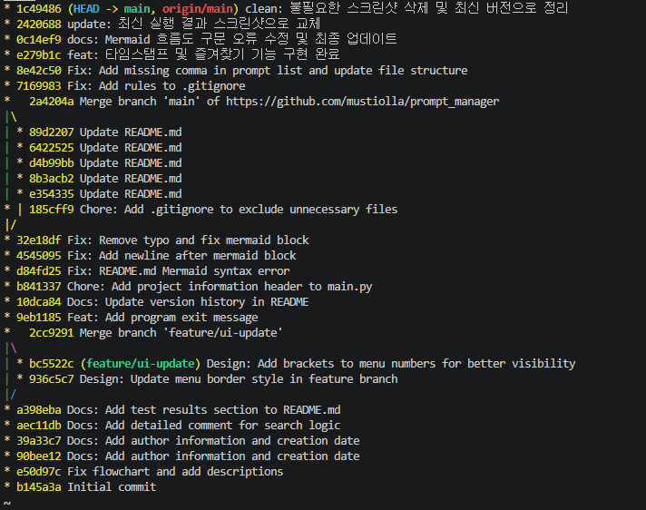
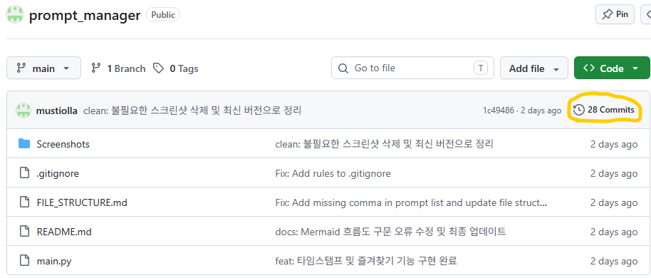

---

# A1-1: 나만의 프롬프트 관리 프로그램
> **Python & Git 기초 미션 (A1-1) 결과 요약**

## 1. 프로젝트 개요
- **프로젝트명:** Prompt Manager (나만의 프롬프트 관리자)
- **개발 기간:** 2026.08
- **목적:** 파편화된 생성형 AI 프롬프트를 체계적으로 저장, 검색, 관리하고 Python 및 Git의 핵심 원리를 실전 적용함.

## 2. 기술 스택 (Tech Stack)
| 구분 | 기술 |
| :--- | :--- |
| **Language** | Python 3.10+ |
| **Tool(개발환경/도구)** | VSCode |
| **VCS(버전관리)** | Git, GitHub |
| **Library** | `datetime` (기본 라이브러리/시간 기록) |

## 3. 핵심 기능 (Key Features)
- **CRUD 기반 관리:** 프롬프트 추가, 전체 목록 조회, 상세 내용 확인.
  (Create: 추가, Read: 목록, 상세보기, 검색, Update: 즐겨찾기 설정, Delete: 삭제)
- **스마트 필터링:** 카테고리별 모아보기 및 키워드 기반 제목/내용 검색.
- **즐겨찾기 시스템:** 자주 사용하는 프롬프트 ⭐ 표시 및 즐겨찾기 목록 관리.
- **데이터 자동 기록:** 프롬프트 생성 시 타임스탬프 자동 기록.

## 4. 기술적 차별점 (Technical Highlights)

### 🛠 함수형 프로그래밍 구조
모든 기능을 독립적인 함수로 설계하여 코드의 재사용성과 가독성을 높였음.
```python
def add_prompt():      # 프롬프트 추가 로직
def show_list():      # 목록 출력 로직
def search_prompt():  # 검색 로직
```

### 📊 효율적인 데이터 구조
`List[Dict]` 구조를 채택하여 데이터 확장성을 고려.
```python
{
    "title": "제목",
    "content": "내용",
    "category": "카테고리",
    "favorite": True,
    "date": "2024-05-22 14:30:05"
}
```

## 5. Git 버전 관리 전략
프로젝트의 **버전 관리**.

- **기능 단위 커밋:** 총 20개 이상의 커밋을 통해 개발 과정을 세밀하게 기록.
- **브랜치 전략:** `main` 브랜치 외에 `feature/list` 브랜치를 생성하여 기능을 독립적으로 개발 후 병합(Merge).
- **문서화:** `README.md`에 Mermaid를 활용한 로직 흐름도 포함.

### Git Workflow 시각화


## 6. 실행 화면 (Demo)

| 1. 프롬프트 목록 보기 | 4. 프롬프트 상세 보기 |
| :---: | :---: |
|  |  |

| 2. 프롬프트 추가 | 3. 프롬프트 검색 |
| :---: | :---: |
|  |  |

| 5-1. 즐겨찾기 설정 | 5-2. 즐겨찾기 해제 |
| :---: | :---: |
|  |  |

## 7. 문제 해결(Troubleshooting)
- **문제:** Git Push 과정에서 원격 저장소와의 충돌 발생.
- **해결:** `git pull`을 통해 변경 사항을 먼저 병합하고, `.gitignore`를 설정하여 불필요한 설정 파일(`__pycache__` 등)이 추적되지 않도록 조치함.


---
**GitHub:** [https://github.com/mustiolla/prompt_manager]

---

## 8. Git 커밋 내역 요약 (Commit History)

프로젝트의 개발 과정을 기록하기 위해 **20회 이상의 의미 있는 커밋(Commit)**을 진행하였습니다. 기능별로 단계를 나누어 작업하여 코드의 변경 사항을 체계적으로 관리했습니다.

### 주요 커밋 단계
1. **초기 설정**: Git 저장소 초기화, `.gitignore` 설정, 기본 파일 구조 생성
2. **기본 기능 구현**: 프롬프트 추가, 전체 목록 조회, 검색 기능 개발
3. **기능 고도화**: 상세 보기, 즐겨찾기 설정/해제, 타임스탬프(자동 날짜 기록) 추가
4. **예외 처리 및 리팩토링**: 입력 오류 방지 로직 추가, 함수 구조 개선
5. **문서화 및 마무리**: README.md 작성, 실행 화면 캡처, 최종 코드 주석 정리

### 커밋 로그 스크린샷

(GitHub에서 확인한 커밋 수)*
