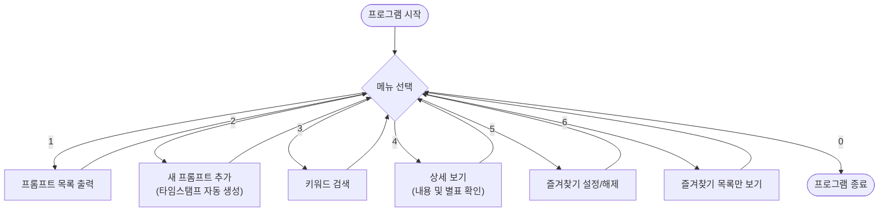

# 🚀 나만의 프롬프트 관리 프로그램

AI 프롬프트를 효율적으로 관리하고 저장하는 파이썬 도구입니다.
이 프로젝트는 Git과 GitHub를 활용한 버전 관리 학습을 위해 제작되었습니다.

### 1. 프로그램 흐름도

## ✅ 테스트 결과
프로그램의 주요 기능들이 다음과 같이 정상적으로 작동함을 확인했습니다.

1. **프롬프트 추가**: 새로운 제목과 내용을 입력하면 리스트에 정상적으로 저장됨.
2. **목록 조회**: 저장된 모든 프롬프트가 번호와 함께 출력됨.
3. **키워드 검색**: 제목이나 내용에 포함된 단어로 검색 시 해당 항목만 필터링됨.
4. **상세 보기**: 특정 번호를 선택했을 때 전체 내용과 즐겨찾기 여부가 표시됨.
5. **예외 처리**: 잘못된 메뉴 번호나 빈 값을 입력했을 때 안내 메시지 출력됨.
## 업데이트 기록
- v1.0.0: 초기 버전 출시
- v1.1.0: 사용자 인터페이스(UI) 개선 및 종료 메시지 추가
