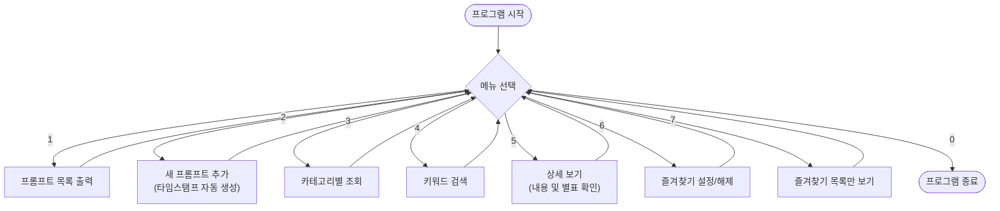

# 🚀 나만의 프롬프트 관리 프로그램

AI 프롬프트를 효율적으로 관리하고 저장하는 파이썬 도구입니다.
이 프로젝트는 Git과 GitHub를 활용한 버전 관리 학습을 위해 제작되었습니다.

---

## 📌 프로그램 개요

AI 도구를 자주 사용하다 보면 좋은 프롬프트를 따로 저장하고 싶을 때가 많습니다.
이 프로그램은 그런 프롬프트를 **카테고리별로 분류**하고,
**키워드 검색**과 **즐겨찾기** 기능으로 빠르게 찾아볼 수 있도록 도와줍니다.

### 주요 특징
- 📂 카테고리별 프롬프트 분류 (텍스트 생성 / 이미지 생성 / 영상 생성 / 자동화 등)
- 🔍 제목 + 내용 동시 키워드 검색
- ⭐ 즐겨찾기 등록 및 목록 조회
- 🕐 프롬프트 등록 시 타임스탬프 자동 저장
- ⚠️ 잘못된 입력에 대한 예외 처리 포함

---

## 🗂️ 파일 구조

```
prompt-manager/
│
├── main.py           # 메인 실행 파일 (전체 기능 포함)
└── README.md         # 프로젝트 설명 문서
```

---

## ⚙️ 기능 설명

| 번호 | 기능 | 설명 |
|------|------|------|
| 1 | 프롬프트 목록 | 저장된 전체 프롬프트를 번호/카테고리/등록일과 함께 출력 |
| 2 | 프롬프트 추가 | 제목, 내용, 카테고리를 입력해 새 프롬프트 등록 |
| 3 | 카테고리별 조회 | 원하는 카테고리의 프롬프트만 필터링해서 출력 |
| 4 | 키워드 검색 | 제목 또는 내용에 포함된 단어로 검색 |
| 5 | 상세 보기 | 번호 선택 시 전체 내용 + 즐겨찾기 여부 출력 |
| 6 | 즐겨찾기 관리 | 즐겨찾기 설정 / 해제 (★ 토글 방식) |
| 7 | 즐겨찾기 목록 | 즐겨찾기 등록된 프롬프트만 모아서 출력 |
| 0 | 종료 | 프로그램 종료 |

---

## 🗺️ 프로그램 흐름도



---

## 💻 프로그램 실행 방법

### 1단계 - 프로그램 실행

```bash
python main.py
```

> ✅ 실행 성공 시 아래 화면이 나타납니다.

```
==============================
   나만의 프롬프트 관리자
----------------------------------------
[1] 프롬프트 목록
[2] 프롬프트 추가
[3] 카테고리별 조회
[4] 프롬프트 검색
[5] 프롬프트 상세 보기
[6] 즐겨찾기 관리
[7] 즐겨찾기 목록
[0] 종료
----------------------------------------
선택:
```

---

### 2단계 - 사용 예시

**프롬프트 추가하기**

```
선택: 2

--- 새 프롬프트 등록 ---
제목을 입력하세요: 유튜브 썸네일 문구 생성
내용을 입력하세요: 조회수를 높이는 유튜브 썸네일 문구 5개를 추천해줘.

[카테고리 목록]
1. 텍스트 생성
2. 이미지 생성
3. 영상 생성
4. 페르소나
5. 자동화
6. 기타

카테고리 번호 선택: 1

✅ '유튜브 썸네일 문구 생성' 등록 완료! (시간: 2026-08-12 10:30:00)
```

**키워드 검색하기**

```
선택: 4

검색할 키워드를 입력하세요: 자동화

'자동화' 검색 결과:
--------------------------------------------------
[자동화] LLM 기반 회의록 자동화
[자동화] 최신 논문 요약 메일 발송
```

---

## 🛠️ 기술 스택

| 항목 | 내용 |
|------|------|
| 언어 | Python 3.13 |
| 외부 라이브러리 | 없음 (표준 라이브러리만 사용) |
| 사용 모듈 | `datetime` |
| 데이터 저장 | 프로그램 내부 리스트 (실행 중에만 유지) |
| 버전 관리 | Git / GitHub |

---

## ✅ 테스트 결과

프로그램의 주요 기능들이 다음과 같이 정상적으로 작동함을 확인했습니다.

1. **프롬프트 추가**: 새로운 제목과 내용을 입력하면 리스트에 정상적으로 저장됨.
2. **목록 조회**: 저장된 모든 프롬프트가 번호와 함께 출력됨.
3. **키워드 검색**: 제목이나 내용에 포함된 단어로 검색 시 해당 항목만 필터링됨.
4. **상세 보기**: 특정 번호를 선택했을 때 전체 내용과 즐겨찾기 여부가 표시됨.
5. **예외 처리**: 잘못된 메뉴 번호나 빈 값을 입력했을 때 안내 메시지 출력됨.

---

## 📅 업데이트 기록

- **v1.0.0**: 초기 버전 출시
- **v1.1.0**: 사용자 인터페이스(UI) 개선 및 종료 메시지 추가
```
